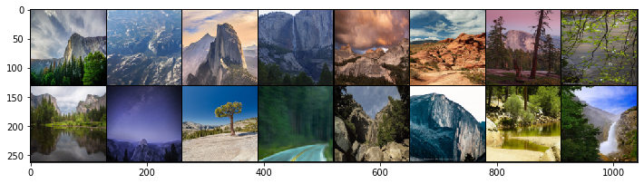
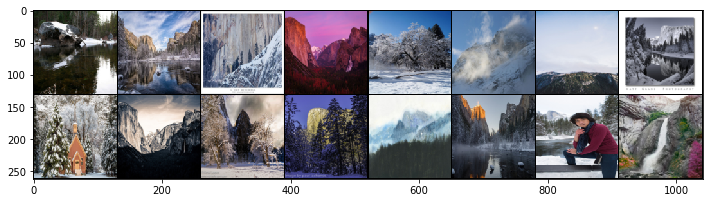

# Project: Train a cycle-GAN to transform between summer and winter images of Yosemite National Park

In this project we implement a cycle-GAN and train it to transform summer images of the Yosemite National Park to winter images. The training set consists of a collection of Yosemite national park's images taken during the summer and winter seasons. The summer and winter images are random and have do not necessarily have a one-to-one correspondence between the two sets. For example, in the paper that introduced [CycleGANs](https://arxiv.org/abs/1703.10593), the authors are able to translate between images of horses and zebras, even though there are no images of a zebra in exactly the same position as a horse or with exactly the same background, etc. Thus, CycleGANs enable learning a mapping from one domain X to another domain Y without having to find perfectly-matched, training pairs!

# cycle-GAN Architecture

As is the general case with GANs, the model consists of two advesarial networks: the generator and the discriminator. The generator is responsible for generating a fake image and the discriminator is responsible for classifying its input images as real or fake. 

A cycle-GAN is made up of two generators and two discriminators. 

- The first generator (G_XtoY) expects its input to be images from domain X. It then tries to transform these images to look like those from the domain Y. 

- The second generator (G_YtoX) expects its input to be images from domain Y. It then tries to transform these images to look like those from the domain X.

- The first discrimator (D_Y) tries to classify if the input images are fake of real images from domain Y

- The second generator (D_X) tries to classify if the input images are fake of real images from domain X

## Discriminator

Each discriminator is a [Fully Convolutional Network (FCN)](https://arxiv.org/abs/1411.4038) consisting of 5 convolutional layers.  All the  convolutional layers except the last one have a kernel of size 4. The last convolutional layer has a kernel size of 8.

As the image passes through the discriminator, it gets  transformed as follows:```(3,128,128) -> (64,64,64) -> (128,32,32) -> (256,16,16) -> (512,8,8) -> (1,1,1)```

The first four convolutional layers have a stride of 2 and padding of size 1. Each of these is followed by a batchnorm layer and have a Leaky_ReLU activation. The final convolutional layer acts act the output layer of the dicriminator. It has a stride 1, no padding and no batchnorm. No activation is applied to the output of the final convolutional layer.

## Generator

The generators, G_XtoY and G_YtoX (sometimes called F), are made of an encoder, a conv net that is responsible for turning an image into a smaller feature representation, and a decoder, a transpose_conv net that is responsible for turning that representation into an transformed image. These generators, one from XtoY and one from YtoX, have the following architecture:


This network sees a 128x128x3 image, compresses it into a feature representation of size 256 x 16 x 16 as it goes through three convolutional layers and reaches a series of [residual blocks](https://arxiv.org/abs/1512.03385). It goes through  6  of these residual blocks, then it goes through three transpose convolutional layers which upsample the output of the resnet blocks and create a new image of size 128 x 3 x 3!

Most of the convolutional and transpose-convolutional layers have BatchNorm and ReLu functions applied to their outputs with the exception of the final transpose convolutional layer, which has a tanh activation function applied to the output. Also, the residual blocks are made of convolutional and batch normalization layers.

The overall architechture of both the generators follows a [U-Net](https://arxiv.org/pdf/1505.04597.pdf) like configuration such that the second and the third encoder layers are connected via a skip-connetion to the inputs of the second and the first decoder layers respectively. 

# Cycle Consistency Loss
Besides the regular GAN training, a key component of training CycleGANs is the ```cycle consistency loss```. The idea is to ensure that the transformation of the image between the two domains is self-consistent such that the two generators act as inverse functions for each other. Thus if an images from domain X is passed through G_XtoY and then the transformed image is passed through G_YtoX, the final image so obtained is as close as possible to the the original image. 

# Training

We trained the cyle-GAN for 6000 epochs with the Adam optimizer at a learning rate lr = 0.0002 along with momentum terms beta1 = 0.5 and beta2 = 0.999.

# Training Images

Following is sample of Yosemite's summer images used for trainig:



And following is a sample of Yosemite's winter images used for training:



# Generated Images

Following are sample of summer to winter transformations as produced by the cycle-GAN during various stages of its training

### After 100 epochs:


### After 100 epochs:


### After 6000 epochs:

